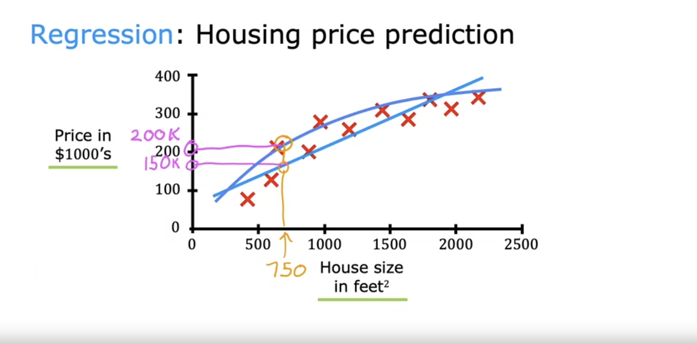
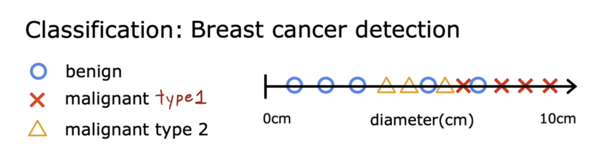
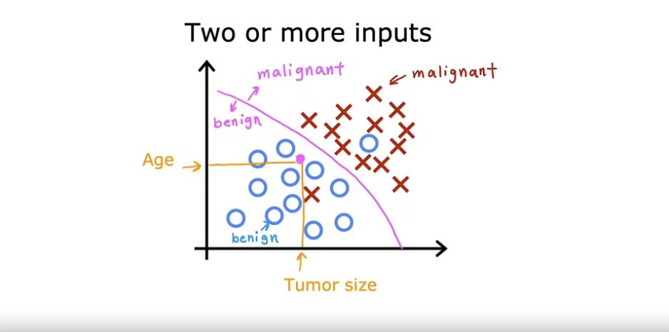
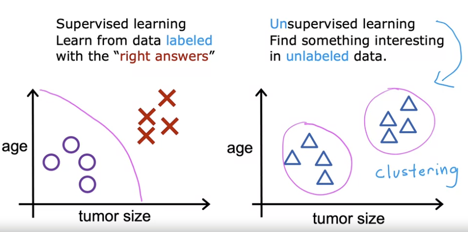
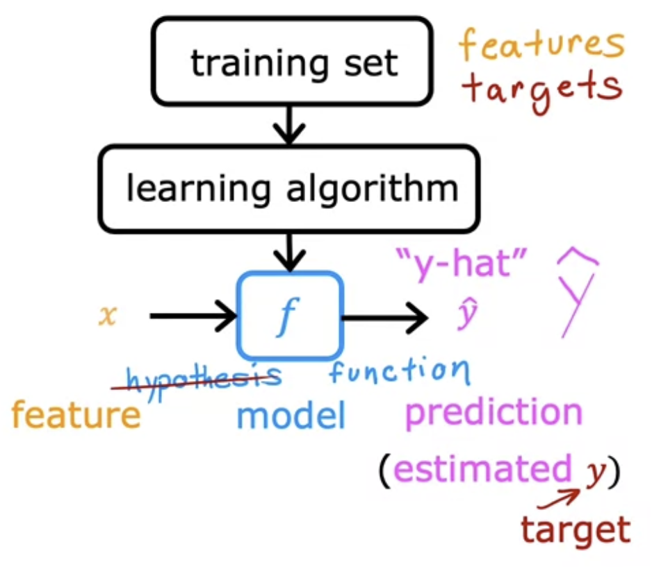
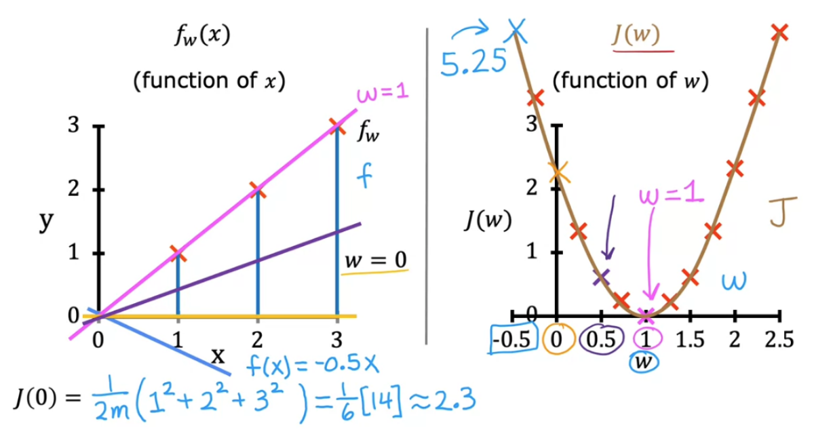

## Goals of course

This course will teach you

1. the machine learning algorithms, and
2. practical advice on when and how to _apply_ them.

Just like how you can't just build a house by learning how to use a hammer and a drill, you can't build machine learning systems just by learning the algorithms.

That's why this course spends a lot of time on _application_.

## What is Machine Learning?

Machine learning definition:

> "Field of study that gives computers the ability to learn without being explicitly programmed."
>
> — Arthur Samuel (1959)

There are 4 types of machine learning:

- Supervised learning
- Unsupervised learning
- Recommender systems
- Reinforcement learning

Supervised learning is used _most_ in real-world applications. Additionally, it's seen the most rapid advancements.

Courses 1 and 2 focus on supervised learning, while course 3 focuses on the rest.

## Supervised vs. Unsupervised Learning

### Supervised learning

**Supervised learning** is a set of machine learning algorithms that learn $f(x) = y$ input-output mappings. The key way it learns these mappings is by being given _labeled data_. In other words, we provide a set of input examples, where the "right" output for each example is known upfront to teach the learning algorithm.

Eventually, the goal of the supervised learning algorithm is to learn to accept input $x$ alone and return a reasonably accurate prediction of output $y$.

**Note**: The function $f$ is the learning algorithm that you use.

One type of supervised learning algorithm is a **regression** algorithm. These algorithms are defined by the fact that they try to predict a number from _infinitely_ many possible numbers.

For example, we may have a set of house sizes (inputs) and their prices (outputs). Given this data, we build a regression algorithm that can take 750 square feet as input and output the predicted price of the house.

> **Fun fact**: If you plot learning algorithm $f$ on an x-axis and y-axis, sometimes it is a straight line, sometimes a curve, or some other shape relative to the data. What shape it is depends on how you systematically _configure_ the learning algorithm.

Another type of supervised learning algorithm is a **classification** algorithm. These algorithms are defined by the fact that they try to predict a _finite small_ number of output _categories_ or _classes_ (where outputs can be non-numeric).

For example, we may have a set of tumors, where inputs are sizes and outputs are possible diagnoses of the tumors:

**Important**: It's possible to use more than one input. In practice, many machine learning algorithms use _many_ inputs.

For example, instead of just using tumor size as the only input, we can also include age as an input too.

> In this scenario, the learning algorithm may try to figure out a boundary line that separates benign from malignant cases.

### Unsupervised learning

**Supervised learning** is a set of machine learning algorithms that are given inputs $x$ without "right" outputs $y$. Consequently, instead of predicting outputs, the goal is to find something interesting—some structure or pattern—in the _unlabeled data_.

In our tumor example, we may only be given input data on age and tumor size for each tumor but not any diagnosis. So, instead of diagnosing the tumor, our unsupervised learning algorithm may try to _cluster_ them. This is a type of unsupervised learning known as a **clustering algorithm**.

Other examples of unsupervised learning in the form of clustering:

- Google clustering news articles by a shared topic
- Clustering individuals into types based on the genes they have turned on or off
- Clustering a business' customers into different market segments

Other types of unsupervised learning:

- **Anomaly detection**: Finds unusual data points
  - Example: Fraud detection
- **Dimensionality reduction**: Compresses a large dataset into a much smaller dataset while losing as little information as possible

### Training sets, training examples, and notation

A **training set** is a dataset you give to a learning model to train it. Each data point in a training set is called a **training example**.

In this course, we have the following notation related to training sets and training examples:

- $m$
  - Number of training examples in a training set
- $x$
  - Input data
  - Called the **input variable** or **input feature** or just **feature**
- $y$
  - Output data
  - Called the **output variable** or **target variable** or just **target**
- $\^{y}$
  - Prediction or estimation of $y$ produced by model
- $(x, y)$
  - A single training example
- $(x^{(i)}, y^{(i)})$
  - If we index our training examples, this refers to the $i^{\text{th}}$ training example

### Formalization of supervised learning

1. Training set containing features ($x$) and targets ($y$) passed as inputs to a learning algorithm
2. Learning algorithm produces a function $f$ that takes $x$ as input and outputs $\^{y}$
   - $f$ is called a **model** (or sometimes hypothesis)

## Regression Model

### Linear regression model

When a learning algorithm produces a model/function $f$, one thing we can ask ourselves is how do we represent $f$? In other words, what is the mathematical formula for $f$?

In a **linear regression model**, $f$ is formally represented as a _linear function_: $f_{w, b}(x) = wx + b$.

> This definition of $f$ is a linear regression model with _one_ variable—often called _univariate_ linear regression.

In informal terms, a linear regression model is a particular type of regression model that predicts numbers by fitting a _straight line_ to the data.

**Note**: $w$ and $b$ are called the **parameters** of the model—sometimes also called **coefficients** or **weights**. They are variables you _adjust_ during training in order to _improve_ the model.

> In the case of linear regression, $w$ is the slope, determining the slope of the line, and $b$ is the y-intercept, determining the position of the line.

Here's some examples of different values for $w$ and $b$ and the different lines they produce:

### Cost function

In linear regression, our ultimate goal is to produce a line that fits the training set as well as possible.

More specifically, the goal is to find values for parameters $w$ and $b$ such that $\^{y}^{(i)}$ is as close to $y^{(i)}$ for many or all $(x^{(i)}, y^{(i)})$ in the training set.

But how do we know when a linear regression model succeeds or fails in this goal? In general, when we build a model, how can we tell how well it's doing so we can try to make it better?

**Answer**: Construct a **cost function**—a function that measures how well a model fits its data.

In particular, we will learn the **squared error cost function**, one of the most commonly used cost functions for regression problems.

The squared error cost function basically computes the average squared error between every $\^{y}^{(i)}$ and $y^{(i)}$.

To compute the average squared error, we do the following:

1. For all $m$ training examples, compute the **error term**—the difference between the prediction and the target—and square it: $(\^{y}^{(i)} - y^{(i)})^2$
2. Sum up all squared errors from the $m$ training examples
3. Divide the sum by $m$ to get the average/mean
4. Divide again by $2$ (done by convention in ML to make later calculations look neater)

Formally, this is our squared error cost function $J(w, b)$:

$$
J(w, b) = \frac{1}{2m}\sum_{i = 1}^{n} \ (\^{y}^{(i)} - y^{(i)})^2
$$

> $\^{y}^{(i)}$ can be replaced with $f_{w, b}(x^{(i)})$ since they are equivalent.

**Goal**: Find values of $w$ and $b$ that make the cost function $J(w, b)$ as small as possible.

Next up is examples to help build an intuition around what it really means when $J(w, b)$ is large vs. when $J(w, b)$ is small.

0:30

## Train the Model with Gradient Descent
