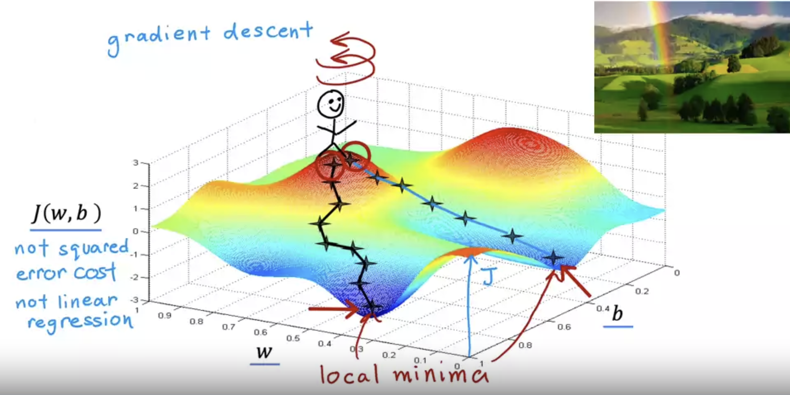

## Goals of course

This course will teach you

1. the machine learning algorithms, and
2. practical advice on when and how to _apply_ them.

Just like how you can't just build a house by learning how to use a hammer and a drill, you can't build machine learning systems just by learning the algorithms.

That's why this course spends a lot of time on _application_.

## What is Machine Learning?

Machine learning definition:

> "Field of study that gives computers the ability to learn without being explicitly programmed."
>
> — Arthur Samuel (1959)

There are 4 types of machine learning:

- Supervised learning
- Unsupervised learning
- Recommender systems
- Reinforcement learning

Supervised learning is used _most_ in real-world applications. Additionally, it's seen the most rapid advancements.

Courses 1 and 2 focus on supervised learning, while course 3 focuses on the rest.

## Supervised vs. Unsupervised Learning

### Supervised learning

**Supervised learning** is a set of machine learning algorithms that learn $f(x) = y$ input-output mappings. The key way it learns these mappings is by being given _labeled data_. In other words, we provide a set of input examples, where the "right" output for each example is known upfront to teach the learning algorithm.

Eventually, the goal of the supervised learning algorithm is to learn to accept input $x$ alone and return a reasonably accurate prediction of output $y$.

**Note**: The function $f$ is the learning algorithm that you use.

One type of supervised learning algorithm is a **regression** algorithm. These algorithms are defined by the fact that they try to predict a number from _infinitely_ many possible numbers.

For example, we may have a set of house sizes (inputs) and their prices (outputs). Given this data, we build a regression algorithm that can take 750 square feet as input and output the predicted price of the house.

> **Fun fact**: If you plot learning algorithm $f$ on an x-axis and y-axis, sometimes it is a straight line, sometimes a curve, or some other shape relative to the data. What shape it is depends on how you systematically _configure_ the learning algorithm.

Another type of supervised learning algorithm is a **classification** algorithm. These algorithms are defined by the fact that they try to predict a _finite small_ number of output _categories_ or _classes_ (where outputs can be non-numeric).

For example, we may have a set of tumors, where inputs are sizes and outputs are possible diagnoses of the tumors:

**Important**: It's possible to use more than one input. In practice, many machine learning algorithms use _many_ inputs.

For example, instead of just using tumor size as the only input, we can also include age as an input too.

> In this scenario, the learning algorithm may try to figure out a boundary line that separates benign from malignant cases.

### Unsupervised learning

**Unsupervised learning** is a set of machine learning algorithms that are given inputs $x$ without "right" outputs $y$. Consequently, instead of predicting outputs, the goal is to find something interesting—some structure or pattern—in the _unlabeled data_.

In our tumor example, we may only be given input data on age and tumor size for each tumor but not any diagnosis. So, instead of diagnosing the tumor, our unsupervised learning algorithm may try to _cluster_ them. This is a type of unsupervised learning known as a **clustering algorithm**.

Other examples of unsupervised learning in the form of clustering:

- Google clustering news articles by a shared topic
- Clustering individuals into types based on the genes they have turned on or off
- Clustering a business' customers into different market segments

Other types of unsupervised learning:

- **Anomaly detection**: Finds unusual data points
  - Example: Fraud detection
- **Dimensionality reduction**: Compresses a large dataset into a much smaller dataset while losing as little information as possible

### Training sets, training examples, and notation

A **training set** is a dataset you give to a learning model to train it. Each data point in a training set is called a **training example**.

In this course, we have the following notation related to training sets and training examples:

- $m$
  - Number of training examples in a training set
- $x$
  - Input data
  - Called the **input variable** or **input feature** or just **feature**
- $y$
  - Output data
  - Called the **output variable** or **target variable** or just **target**
- $\hat{y}$
  - Prediction or estimation of $y$ produced by model
- $(x, y)$
  - A single training example
- $(x^{(i)}, y^{(i)})$
  - If we index our training examples, this refers to the $i^{\text{th}}$ training example

### Formalization of supervised learning

1. Training set containing features ($x$) and targets ($y$) passed as inputs to a learning algorithm
2. Learning algorithm produces a function $f$ that takes $x$ as input and outputs $\hat{y}$
   - $f$ is called a **model** (or sometimes hypothesis)

## Regression Model

### Linear regression model

When a learning algorithm produces a model/function $f$, one thing we can ask ourselves is how do we represent $f$? In other words, what is the mathematical formula for $f$?

In a **linear regression model**, $f$ is formally represented as a _linear function_: $f_{w, b}(x) = wx + b$.

> This definition of $f$ is a linear regression model with _one_ variable—often called _univariate_ linear regression.

In informal terms, a linear regression model is a particular type of regression model that predicts numbers by fitting a _straight line_ to the data.

**Note**: $w$ and $b$ are called the **parameters** of the model—sometimes also called **coefficients** or **weights**. They are variables you _adjust_ during training in order to _improve_ the model.

> In the case of linear regression, $w$ is the slope, determining the slope of the line, and $b$ is the y-intercept, determining the position of the line.

Here's some examples of different values for $w$ and $b$ and the different lines they produce:

### Cost function

In linear regression, our ultimate goal is to produce a line that fits the training set as well as possible.

More specifically, the goal is to find values for parameters $w$ and $b$ such that $\hat{y}^{(i)}$ is as close to $y^{(i)}$ for many or all $(x^{(i)}, y^{(i)})$ in the training set.

But how do we know when a linear regression model succeeds or fails in this goal? In general, when we build a model, how can we tell how well it's doing so we can try to make it better?

**Answer**: Construct a **cost function**—a function that measures how well a model fits its data.

In particular, we will learn the **squared error cost function**, one of the most commonly used cost functions for regression problems.

The squared error cost function basically computes the average squared error between every $\hat{y}^{(i)}$ and $y^{(i)}$.

To compute the average squared error, we do the following:

1. For all $m$ training examples, compute the **error term**—the difference between the prediction and the target—and square it: $(\hat{y}^{(i)} - y^{(i)})^2$
2. Sum up all squared errors from the $m$ training examples
3. Divide the sum by $m$ to get the average/mean
4. Divide again by $2$ (done by convention in ML to make later calculations look neater)

Formally, this is our squared error cost function $J(w, b)$:

$$
J(w, b) = \frac{1}{2m}\sum_{i = 1}^{n} \ (\hat{y}^{(i)} - y^{(i)})^2
$$

> $\hat{y}^{(i)}$ can be replaced with $f_{w, b}(x^{(i)})$ since they are equivalent.

**Goal**: Find values of $w$ and $b$ that _minimize_ the cost function $J(w, b)$ as much as possible.

### Visualizing cost function in 2D and 3D

To find the minimum of $J(w, b)$, we need a way to visualize the function.

To begin, let's visualize a simpler cost function $J(w)$ where $w$ is the only parameter (so it's always the case that $b = 0$).

> On the left, we display different functions $f_w$ for different values of $w$. On the right, we display the values of $J(w)$ in relation to the values of $w$.

You'll notice a parabola or bowl shape for $J(w)$. In this visualization, finding the value of $w$ that produces the minimum $J(w)$ amounts to finding the vertex of the parabola.

Next, let's visualize the cost function $J(w, b)$ using a 3D surface plot:

To find the values of $w$ and $b$ that produce a minimum $J(w, b)$, we create a _contour plot_ based off of the 3D surface plot:

> The contour plot on the top right is a 2D visualization of the 3D surface plot at the bottom.
>
> Think of a contour plot like a topographical map—as seen in the 2 images to the right. From a bird's eye view, we place circles around a mountain, where each circle represents the set of points on the mountain that are the same height. Each circle is a common height difference from one another.

In a contour plot, you have concentric ovals, where each oval represents all of the values of $w$ and $b$ that have the same output $J(w, b)$. Additionally, outer ovals represent higher values of $J(w, b)$, and inner ovals represent smaller values of $J(w, b)$.

Therefore, the values of $w$ and $b$ that produce the minimum $J(w, b)$ are all found at the innermost oval of the contour plot.

## Train the Model with Gradient Descent

### What is gradient descent?

Manually working out the values of parameters $w$ and $b$ that produce the minimum $J(w, b)$ is tedious and inefficient—and may even stop working as we get to more complex machine learning models.

**Gradient descent** is an algorithm that takes _any_ function as input—including cost functions—and outputs the parameter values that produce the minimum for that function.

> It's one of the most important algorithms in machine learning—used for both simple (e.g., linear regression) and complex (e.g., deep learning) models.

At a high level, the steps of the gradient descent algorithm proceed as follows:

1. Set parameters to some initial values
   - For linear regression, the convention is to set $w = b = 0$
2. Keep changing the parameter values a little bit at a time in an attempt to reduce the cost function
3. Stop when the cost function settles at or near a minimum

As an analogy, in step (1), imagine choosing initial values for your parameters is like dropping yourself onto a random spot on the surface plot representing the cost function:

> **Note**: As the surface plot shows, not all cost functions are a bowl shape. In other words, it's possible for there to be more than 1 minimum.

Think of this surface plot as a golf course with hills and valleys. Your goal is to walk into a valley as fast as possible!

In step (2), you proceed to look around 360 degrees, each time taking a baby step forward that would lead to the _steepest_ descent.

You then continue to repeat step (2) until you finally hit step (3) where you land in a valley—essentially a **local minimum**.

**Important**: In gradient descent, changing the initial values of the parameters can change the local minimum that you settle on. This is shown with the 2 paths in the surface plot above.

**Corollary**: An interesting property of gradient descent is that it can only go downhill. As a result, you can't get from one local minimum to another.

### Implementing gradient descent

When you take a baby step, the actual mathematical implementation of gradient descent involves a small tweak to $w$ by re-assigning its value as

$$
w = w - \alpha \frac{\partial}{\partial w} J(w, b)
$$

where

- $\alpha \in [0,1]$ is the **learning rate** that determines how steep the descent is, and
- $\frac{\partial}{\partial w} J(w, b)$ is the **partial derivative term** of the cost function $J$ that determines the direction of the baby step (more on this later).

A similar small tweak to $b$ is made as

$$
b = b - \alpha \frac{\partial}{\partial b} J(w, b)
$$

The gradient descent algorithm simply repeats these reassignments of $w$ and $b$ until the algorithm **converges**—meaning you reach a local minimum where updates to $w$ and $b$ no longer change much with each additional baby step you take.

**Important**: As a best practice, updates to $w$ and $b$ must be done _simultaneously_ so that the updated value of one parameter doesn't affect the update of another parameter.

The best way to accomplish a simultaneous update is to compute the RHS first:

$$
\begin{align*}
tmp_w &= w - \alpha \frac{\partial}{\partial w} J(w, b) \\
tmp_b &= b - \alpha \frac{\partial}{\partial b} J(w, b) \\
w &= tmp_w \\
b &= tmp_b
\end{align*}
$$

### More on the derivative term

To understand what a single step of gradient descent is doing—especially the derivative term—let's return to our simplified example where $w$ is our only parameter, leading to a parabola/curve shape:

In the 2 examples above, we pick an arbitrary $w$. The top example has $w$ on the right side of the curve, and the bottom example has $w$ on the left side.

Now what we can do is draw a **tangent line** for each point: a line that intersects with exactly a point on a curve.

**Important**: The partial derivative of $J(w)$ is the _slope_ of that tangent line for that point.

Corollaries:

- When the tangent line has a positive slope, we can say the derivative term $\frac{\partial}{\partial w} J(w) > 0$
  - This leads to a _decrease_ of $w$ (since $\alpha$ is non-negative), moving closer to the minimum
- Otherwise, when the tangent line has a negative slope, $\frac{\partial}{\partial w} J(w) < 0$.
  - This leads to an _increase_ of $w$ (since $\alpha$ is non-negative), moving closer to the minimum

In both cases, we see how a step in the gradient descent algorithm brings us closer to the minimum—thanks to the derivative term.

**Note**: When you have converged on a local minimum, the slope of the tangent line representing the derivative is always $0$:

Thus, the re-assignment $w = w - \alpha \cdot 0$ doesn't change $w$ at all. In other words, further gradient descent steps do nothing once you've reached a local minimum.

> Thankfully, this limitation isn't a problem for the squared error cost function, as it is a _convex function_. That just means its global minimum is the only local minimum, so the gradient descent algorithm will always converge on the global minimum.

### More on the learning rate

To understand what the learning rate $\alpha$ does in gradient descent, let's consider what happens when $\alpha$ is too small or too big.

When $\alpha$ is too small (top example), gradient descent becomes too _slow_: it takes many steps to finally reach the minimum.

When $\alpha$ is too big (bottom example), gradient descent can continually overshoot and step over the minimum, never reaching it. In more technical terms, we say gradient descent _fails to converge_ and may even _diverge_—meaning it actually gets further and further away from the minimum.

**Important**: Even though we use a _fixed_ learning rate, as we get closer and closer to a local minimum, gradient descent _automatically_ takes _smaller and smaller_ steps.

**Why**: Consider a curve is typically exponential. So as you take steps closer towards the local minimum for that curve, the slope of each tangent line (i.e., the derivative) gets smaller and smaller, meaning smaller and smaller gradient descent steps.

This effect makes it easier to converge on the local minimum _even though_ the learning rate is fixed.

### Applying gradient descent to linear regression

The formula for the partial derivative of the cost function $J$ with respect to $w$ is

$$
\frac{\partial}{\partial w} J(w, b) = \frac{1}{m} \sum_{i = 1}^{m} (f_{w, b}(x^{(i)}) - y^{(i)}) \cdot x^{(i)}
$$

The formula for the partial derivative of the cost function $J$ with respect to $b$ is

$$
\frac{\partial}{\partial b} J(w, b) = \frac{1}{m} \sum_{i = 1}^{m} f_{w, b}(x^{(i)}) - y^{(i)}
$$

Knowing these formulas, we now have everything we need to run gradient descent in order to find the values of $w$ and $b$ that produce an ideal linear regression model (i.e., a straight line that best fits the data):

$$
\begin{align*}
\text{Repeat}&\text{ until convergence:} \ \lbrace \\

w &= w - \alpha \frac{1}{m} \sum_{i = 1}^{m} (f_{w, b}(x^{(i)}) - y^{(i)}) \cdot x^{(i)} \\

b &= b - \alpha \frac{1}{m} \sum_{i = 1}^{m} f_{w, b}(x^{(i)}) - y^{(i)} \\
\rbrace
\end{align*}
$$

**Note**: Because each step of gradient descent involves computing the error for _every_ single training example—in effect using the full training set at each step—we call this **batch gradient descent**.

> **Fun fact**: Other forms of gradient descent may actually use a subset of training examples at each step!
