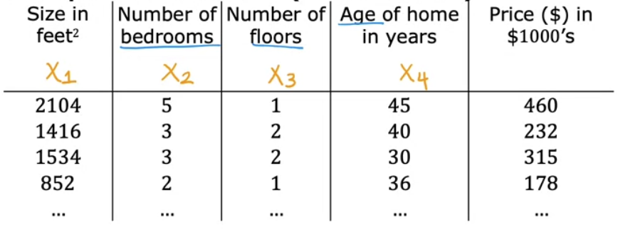
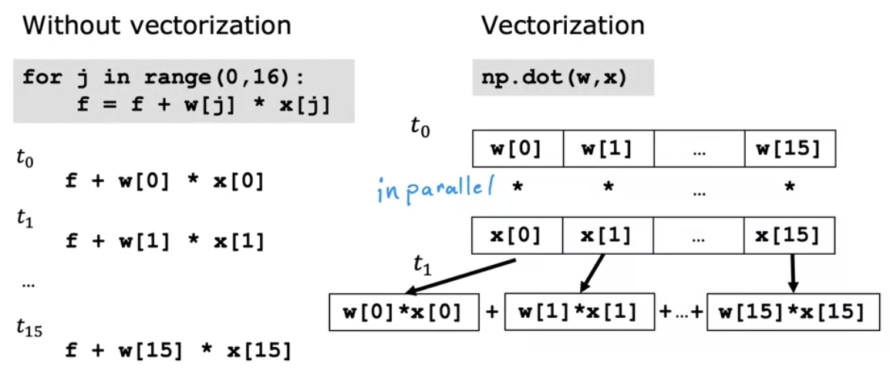
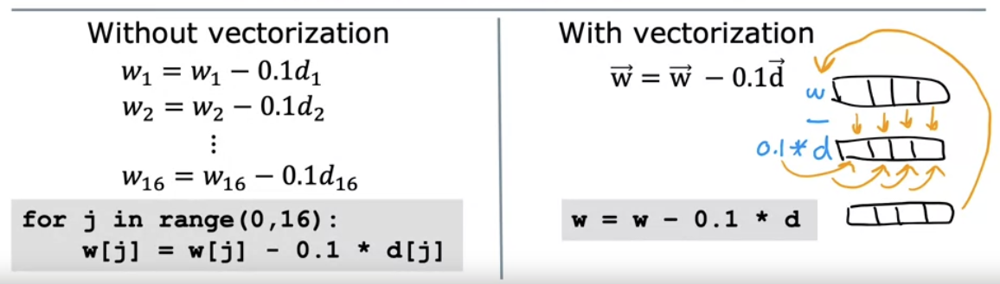
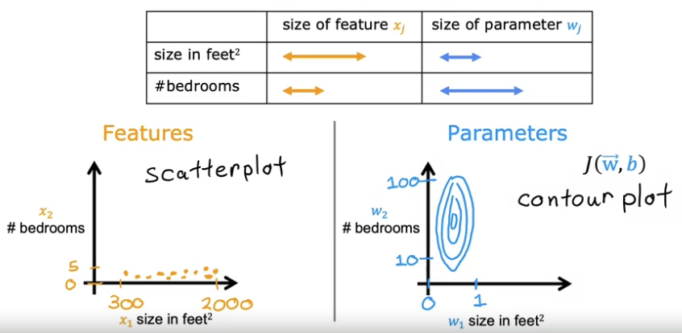
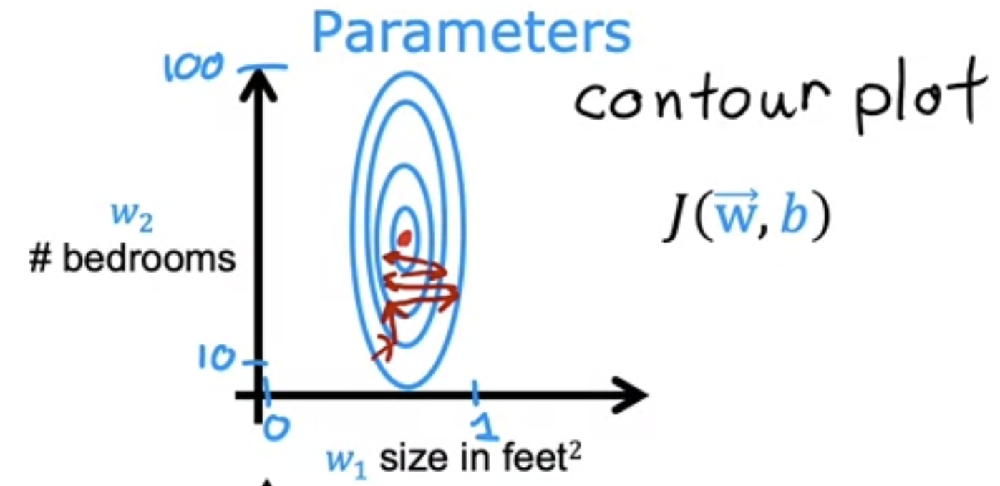
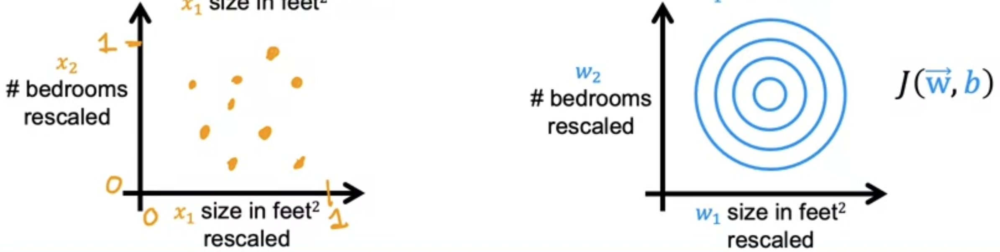
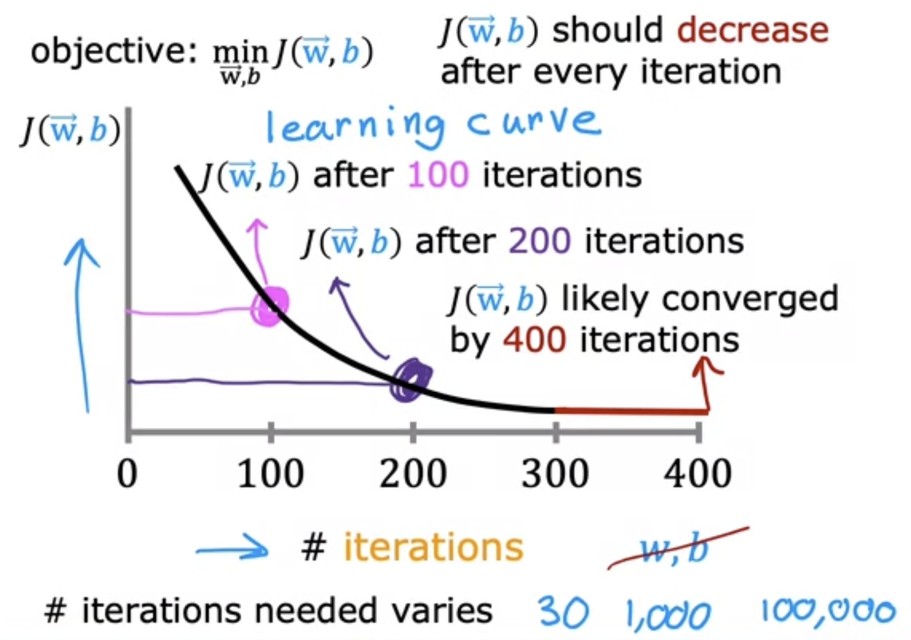
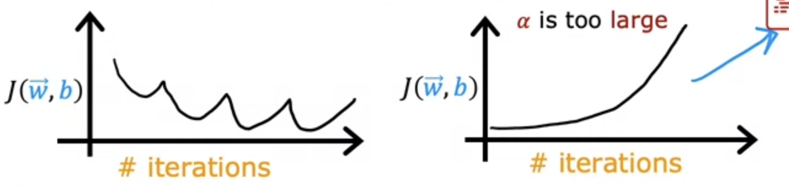
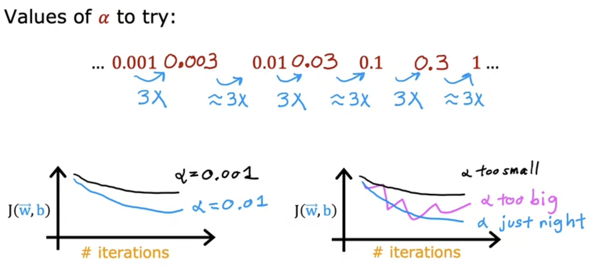

Topics of this week's module:

- How to use multiple input variables
- How to fit non-linear curves to the data

## Multiple Linear Regression

To make linear regression more powerful, we want to be able to use multiple features. This is called **multiple linear regression**, and it is the single most widely used learning algorithm today.

Returning to our housing example, we want to build a multiple linear regression model that considers more features besides house size:



### Notation for multiple linear regression

To better talk about multiple features, we will introduce some new notation:

- $n$
  - Number of features
- $x_j$
  - $j^{\text{th}}$ feature, where $j \in [1..n]$
- $\vec{x}^{(i)}$
  - Vector of all the features of the $i^{\text{th}}$ training example
- $x_j^{(i)}$
  - $j^{\text{th}}$ feature for the $i^{\text{th}}$ training example

### Formula for multiple linear regression

In our new multiple linear regression model, we define it as the following linear function:

$$
f_{w, b}(x) = w_1x_1 + \dots + w_nx_n + b
$$

Or more succinctly, taking the vectors $\vec{w} = [w_1, \dots, w_n]$ and $\vec{x} = [x_1, \dots, x_n]$, we can use the **dot product** $\vec{w} \cdot \vec{x}$ to represent the same sum of products. This gives us the simpler notation

$$
f_{\vec{w}, b}(\vec{x}) = \vec{w} \cdot \vec{x} + b
$$

To take the concrete housing example above, maybe we define our model as

$$
f_{w, b}(x) = 0.1x_1 + 4x_2 + 10x_3 + -2x_4 + 80
$$

When we read this model, it's basically saying

- Each square foot adds $0.1 \cdot 1000 = 100$ dollars
- Each bedroom adds $4 \cdot 1000 = 4000$ dollars
- Each floor adds $10 \cdot 1000 = 10000$ dollars
- Each year of age subtracts $2 \cdot 1000 = 2000$ dollars
- Base price of any house starts at $80000$ dollars

### Vectorization

**Vectorization** is a way to compute the dot product of vectors efficiently and with far less code. This makes it the preferred approach, especially when the number of features, $n$, is large.

To understand the value of vectorization, let's try to compute a model's prediction without it. In code, we would use a for loop:

```py
w = np.array(n_parameters) # vector
b = 4 # number
x = np.array(n_features) # vector

f = 0
for j in range(0, n):
    f = f + w[j] * x[j]
f = f + b
```

**Problem**: This solution is sequential, where computation of `w[j] * x[j]` only happens after computation of `w[j-1] * x[j-1]`.

To speed this process up, vectorization uses _parallel hardware_—whether through the CPU or through the GPU—to compute the dot product. The result is the following code:

```py
f = np.dot(w, x) + b
```

> This is one of the reasons why GPU hardware is so popular for machine learning.

**Importance**: Vectorization and the parallel processing underlying it has become essential for machine learning algorithms, as many of them run on very large data sets.

### Vectorization under the hood

Consider the following example where we compute a model's prediction that has 16 features:



On the left, we must run the computation in sequence.

On the right, we have 2 steps of parallel processing:

- Calculating products
- Adding together all of the products

Similarly, consider the following example where we compute one step in gradient descent for the same model with 16 features:



On the left, we must update each parameter $w_j$ in sequence.

On the right, we update each parameter $w_j$ in parallel as a single step.

### Vectorization applied to gradient descent for multiple linear regression

We are going to use vectors now, so we will make some updates to the linear regression model, its cost function, and gradient descent:

For the model (known already):

$$
f_{\vec{w}, b}(\vec{x}) = \vec{w} \cdot \vec{x} + b
$$

For the cost function:

$$
J(\vec{w}, b)
$$

For gradient descent:

$$
\begin{align*}
\text{Repeat}&\text{ until convergence:} \ \lbrace \\

w_j &= w_j - \alpha \frac{\partial}{\partial w_j} J(\vec{w}, b) \tag{for all $j \in [1..n]$} \\
b &= b - \alpha \frac{\partial}{\partial b} J(\vec{w}, b) \\
\rbrace
\end{align*}
$$

More specifically, here are the formulas for the derivative terms now that there's $n$ features:

$$
\begin{align*}
\frac{\partial}{\partial w_j} J(\vec{w}, b) &= \frac{1}{m} \sum_{i=1}^{m} ( f_{\vec{w}, b}(\vec{x}^{(i)}) - y^{(i)}) x_j^{(i)} \\

\frac{\partial}{\partial b} J(\vec{w}, b) &= \frac{1}{m} \sum_{i=1}^{m} ( f_{\vec{w}, b}(\vec{x}^{(i)}) - y^{(i)}) \\
\end{align*}
$$

Key differences are

- we now pass vectors $\vec{w}$ and $\vec{x}^{(i)}$ to function $f$, and
- we must specify feature $j$ at training example $i$ for value $x$.

### Normal equation

The **normal equation** is an alternative approach to gradient descent for solving linear regression problems.

Instead of an iterative process (like gradient descent), the normal equation solves a linear progression problem in a _single step_.

Disadvantages:

- Only works for linear regression and nothing else
- Becomes slow if the numbers of features, $n$, is large ($> 10000$)

**Key takeaway**: Although we won't show how the normal equation works, ML libraries may use it under the hood, so it's worth being aware of it.

## Gradient Descent in Practice

To make gradient descent work as well as possible, we want to be able to

- choose and scale features appropriately, and
- choose the appropriate learning rate $\alpha$.

### Feature scaling

**Observation**: Given feature $x_i$ with a range of _relatively large_ (or resp. small) values, a good model is more likely to choose a _relatively small_ (or resp. large) parameter value $w_i$.

**Why**:

- A large (or resp. small) $x_i$ means that any change to parameter $w_i$ leads to a corresponding large (or resp. small) change to the prediction.
  - That's because the prediction $f_{\vec{w}, b}(\vec{x})$ has $w_i \cdot x_i$ as one of its terms.
- Therefore, a good model is more likely to choose a small (or resp. large) parameter $w_i$ in order to minimize cost function $J$.

For example, consider a training set with 2 features: $x_1$ (house size in square feet) and $x_2$ (number of bedrooms). $x_1$ has a relatively large range of values—between 300 and 2000. $x_2$ has a relatively small range of values—between 0 and 5.

Here's how these features look in a scatter plot and contour plot:



- On a scatter plot, we see this size disparity between $x_1$ and $x_2$
- On a contour plot, because of this size disparity, we see that the minimization of cost function $J$ takes on a narrow/skinny oval shape
  - _Recall that a large $x_i$ leads to a small $w_i$ (and vice versa)_

**Problem**: A narrow/skinny contour plot for cost function $J$ has a tendency to lead to more bouncing around during gradient descent, slowing down the algorithm's ability to converge on a local minimum.



**Solution**: Scale the features, so they all take on a comparable range of values. This will create a more circular contour plot that more quickly converges on a local minimum.



**Key takeaways**:

- Features with different ranges of values can cause gradient to run more slowly
- Scaling the features so they all take on a comparable range of values mitigates this problem, speeding up gradient descent

### Implementing feature scaling

Recall our training set with features $x_1$ and $x_2$, where

- $300 \leq x_1 \leq 2000$
- $0 \leq x_2 \leq 5$

**Scaling strategy 1:** Divide each feature by its corresponding maximum.

In our example, for features $x_1^i, x_2^i$ in each training example $i$, we set $scaled(x_1^i) = \frac{x_1^i}{2000}$ and $scaled(x_2^i) = \frac{x_2^i}{5}$.

As a result, in our example, we get

- $0.15 \leq x_1 \leq 1$
- $0 \leq x_2 \leq 1$

**Scaling strategy 2**: Apply _mean normalization_.

Here's the process:

1. Compute the mean $\mu_j$ across each feature $x_j$
2. For each feature $x_j^i$ in each training example $i$, update $scaled(x_j^i) = \frac{x_j^i - \mu_j}{max - min}$
   - In our example, $scaled(x_1^i) = \frac{x_1^i - \mu_1}{2000 - 300}$

As a result, in our example, we get

- $-0.18 \leq x_1 \leq 0.82$ given $\mu_1 = 600$
- $-0.46 \leq x_2 \leq 0.54$ given $\mu_2 = 2.3$

**Note**: Mean normalization scales features such that they become centered around zero.

**Scaling strategy 3**: Apply _z-score normalization_.

Here's the process:

1. Compute the mean $\mu_j$ and standard deviation $\sigma_j$ across each feature $x_j$
2. For each feature $x_j^i$ in each training example $i$, update $scaled(x_j^i) = \frac{x_j^i - \mu_j}{\sigma_j}$

As a result, in our example, we get

- $-0.67 \leq x_1 \leq 3.1$ given $\mu_1 = 600$ and $\sigma_1 = 450$
- $-1.6 \leq x_2 \leq 1.9$ given $\mu_2 = 2.3$ and $\sigma_2 = 1.4$

**Rule of thumb**: Aim to scale each feature $x_j$ so that its range is roughly $-1 \leq x_j \leq 1$. This applies _especially_ to large ranges of values (e.g., $-100 \leq x_j \leq 100$) and small ranges of values (e.g., $-0.001 \leq x_j \leq 0.001$) that tend to slow gradient descent down more.

**Note**: The target lower and upper bounds can be loose though. For example, ranges like $-3 \leq x_j \leq 3$ and $0 \leq x_j \leq 3$ may be acceptable without any rescaling.

**Pro tip**: When in doubt, just rescale anyways, as there's almost never any harm in performing feature scaling.

### Checking gradient descent for convergence

**Question**: When running gradient descent, how can you tell if it's converging?

> That is, how do you know when it's found parameters close to the global minimum of cost function $J$?

**Answer**: Create a **learning curve**.

**How**: For each iteration of gradient descent, use the current parameters to plot the current cost of $J$, effectively creating a curve.



> **Note**: In practice, it's very difficult to know in advance how many iterations it will take for gradient descent to converge. This depends on each application.

Graphical indicators that gradient descent is working:

- Each subsequent iteration should always _decrease_ the cost of $J$
  - **However**: If an iteration _increases_ the cost of $J$, that is a sign of a poorly chosen—often too large—learning rate $\alpha$ (or a bug in the code)
- When the learning curve begins to _flatten out_, that is a sign of convergence

**Alternative**: Instead of a learning curve to determine convergence, we can also use an **automatic convergence test**.

Simply choose a small variable $\epsilon$, e.g., $\epsilon = 0.001$. If an iteration decreases $J$ by $\leq \epsilon$, we declare convergence.

**Challenge**: This test depends heavily on choosing the right $\epsilon$.

### Choosing the learning rate

Recall that the learning rate $\alpha$ can either be too small (leading gradient descent to run too slowly) or too large (leading gradient descent to diverge instead of converge).


**Goal**: Choose the learning rate $\alpha$ that decreases cost function $J$ both _rapidly_ and _consistently_.

Signs of a problem with gradient descent:

- Gradient descent runs too slowly
  - $\alpha$ is too small
- The learning curve sometimes increase and sometimes decreases
  - $\alpha$ is too large
- The learning curve consistently increase
  - $\alpha$ is too large

The latter two problems are illustrated below:



**Debugging large $\alpha$**: Set $\alpha$ to a really small number, run gradient descent for a handful of iterations, and then check the learning curve to see if you get a consistent decrease in cost. If you do, the issue was with the learning rate. If you don't, the issue is likely related to a bug in the code.

Here's a general strategy for finding an ideal $\alpha$:

1. Restricting yourself to a handful of iterations of gradient descent, plot the learning curves for a handful of different values of $\alpha$—like $0.001$, $0.01$, $0.1$, and $1$
   - You can also test $0.003$, $0.03$, and $0.3$ to get roughly multiples of $3$
2. Find the $\alpha$ that's too small
3. Find the $\alpha$ that's too large
4. Using these lower and upper bounds as a boundary, hone in on the _largest possible_ $\alpha$ that still consistently decreases the cost function $J$



### Feature Engineering

**Feature engineering** is the creation of new features—usually by transforming or combining known features—that make it easier for the learning algorithm to make accurate predictions.

> The intuition is that some features are more predictive than other features.

For example, suppose we have features $x_1$ and $x_2$, the frontage and depth, respectively, of a plot of land. Our goal is to predict the price of that land.

Intuitively, we might think that _area_ of land is more predictive of price. Therefore, we can then create new feature $x_3 = x_1 \cdot x_2$, and include $x_3$ in our learning algorithm.

### Polynomial regression

Given some feature $x$, **polynomial regression** involves feature engineering new features $x^2, x^3, \dots, x^k$, where $k$ is the degree of the polynomial function $f$.

$$
\begin{align*}
  f_{\vec{w}, b}(x) = w_1x + w_2x^2 + \dots + w_kx^k + b
\end{align*}
$$

The end result is a non-linear function that allows you to fit a curve to your data (instead of just a straight line).

> Polynomial regression can also include $x^{\frac{1}{2}} = \sqrt{x}$ as a custom feature.

**Note**: Because each raised $x$ can dramatically change its range of values, feature scaling becomes all the more important to ensure every raised $x$ stays within comparable ranges of values.

**Key takeaway**: For now, you just need to understand that you have this ability to customize and choose features. The second course of this specialization will address the question of _how_ to choose the _right_ features.
