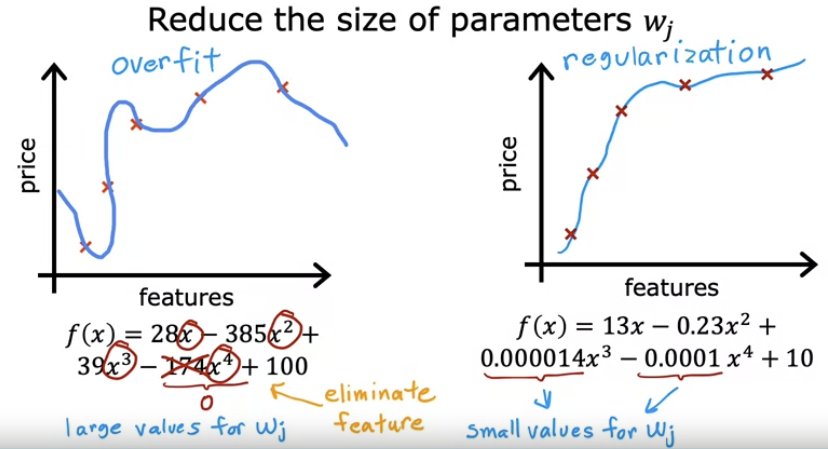
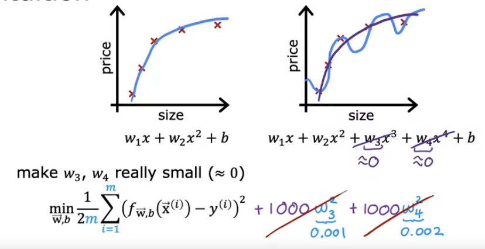
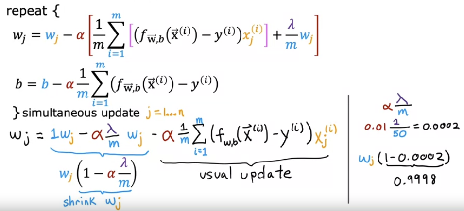

In this module, we will learn the other type of supervised learning: classification.

Topics of this week's module:

- Binary classification using the logistic regression model
  - What is this model, and how does it work?
  - How do we train this model?
- The problem of overfitting and using a method called regularization to solve it

## Classification with Logistic Regression

### What is binary classification?

**Binary classification** is a task where the goal is to categorize data into one of two classes/categories: a **positive class** (yes, true, 1) and a **negative class** (no, false, 0).

### The problem with classification via linear regression

Suppose we have a training set that plots tumors as either benign (0) or malignant (1) using the vertical axis:

Now suppose we apply linear regression on this training set, using a threshold of $0.5$ to set a **decision boundary** (more on this later). That is, if $f(x) \geq 0.5$, we classify the training example as $1$. While if $f(x) < 0.5$, we classify the training example as $0$.

Suppose now that we add a new training example to the far right. Running linear regression on this new training set, we get a new line, leading to a decision boundary that shifts to the right.

**Problem**: As a result, we obtain _new_ classifications—even though we wouldn't expect the introduction of a new training example to change classifications of existing training examples.

> The blue line illustrates when linear regression works, while the green line illustrates when it doesn't.

### Logistic regression

**Logistic regression** fits an s-shaped curve to a binary classification training set:

To create this s-shaped curve, we need a function that accepts features as inputs and then outputs $0 \leq y \leq 1$.

Enter the **sigmoid function** or **logistic function**:

- When $z$ is a very large negative number, $g(z)$ approaches $0$
- When $z$ is a very large positive number, $g(z)$ approaches $1$
- When $z = 0$, $g(z) = \frac{1}{2} = 0.5$

To produce the logistic regression model, we simply pass the output of the linear regression formula to the logistic function:

$$
\begin{align*}
    z &= \vec{w} \cdot \vec{x} + b \tag{linear regression} \\
    \\
    f_{\vec{w}, b}(\vec{x}) &= g(z) \tag{logistic regression} \\
    & = g(\vec{w} \cdot \vec{x} + b) \\
    &= \frac{1}{1 + e^{-(\vec{w} \cdot \vec{x} + b)}}
\end{align*}
$$

**Pro tip**: The way to interpret the logistic regression model $f$ is that it outputs the probability that, given the features as inputs, the output $y = 1$, i.e., is a positive class.

Formally, that's why logistic regression is sometimes written as

$$
\begin{align*}
    f_{\vec{w}, b}(\vec{x}) = P(y = 1 ~|~ \vec{x}; \vec{w}, b)
\end{align*}
$$

> The RHS is read as, "the probability that $y = 1$ given the features $\vec{x}$ and parameters $\vec{w}, b$".

### Decision boundary

A **threshold** is a constant $t \in [0,1]$ that serves as a boundary between whether the probability output of the logistic regression model belongs to prediction $\hat{y} = 1$ or $\hat{y} = 0$.

Namely,

- if $f_{\vec{w}, b}(\vec{x}) \geq t$, then $\hat{y} = 1$, and
- if $f_{\vec{w}, b}(\vec{x}) < t$, then $\hat{y} = 0$.

**Note**: A very common threshold is $0.5$.

**Question**: Given a threshold of $0.5$, when is $\hat{y} = 1$, and when is $\hat{y} = 0$?

**Answer**:

- Recall that $f_{\vec{w}, b}(\vec{x}) = g(z)$
- $\hat{y} = 1$ when $g(z) \geq 0.5$, which occurs when $z \geq 0$ (see sigmoid function graph above to verify)
- Recall also that $z = \vec{w} \cdot \vec{x} + b$
- $\therefore$ $\hat{y} = 1$ exactly when $\vec{w} \cdot \vec{x} + b \geq 0$

> Analogous reasoning applies when we say that $f_{\vec{w}, b}(\vec{x}) < 0.5$ and thus $\hat{y} = 0$ exactly when $z < 0$.

Given some defined parameters $\vec{w}$ and $b$, a **decision boundary** represents the set of points where $z = \vec{w} \cdot \vec{x} + b$ _exactly_ meets the threshold. (In the case of threshold $0.5$, this occurs when $z = 0$.)

For example, consider a training set with features $x_1$ and $x_2$ along with parameters set to $w_1 = w_2 = 1$ and $b = -3$.

> The decision boundary in our example is $x_1 + x_2 = 3$.

**Note**: As long as the degree of $z$ is $1$, the decision boundary will always be a line. However, using higher-order polynomials (i.e., degree of $z$ is $> 1$), we can create non-linear decision boundaries that fit more complex training sets.

## Cost Function for Logistic Regression

### The problem with squared error cost function

Recall that the squared error cost function $J(\vec{w}, b)$ is a convex function, making gradient descent naturally converge on a global minimum.

**Problem**: Applying the same squared error cost function $J$ to a logistic regression model produces a _non-convex_, "wiggly" function, leading to multiple local minima where gradient descent can get stuck.

**Proposal**: We need a _new_ cost function that is actually convex for logistic regression, so gradient descent works nicely.

### New cost function using logistic loss function

Recall the original squared error cost function used in linear regression:

$$
J(\vec{w}, b) = \frac{1}{m} \cdot \sum_{i = 1}^{m} \ \frac{1}{2} (f_{\vec{w}, b}(\vec{x}^{(i)}) - y^{(i)})^2
$$

**Note**: Each term in the summation represents the **loss** for training example $i$. That is, it represents how far off the model is from its target for training example $i$.

Let loss function $L$ represent the loss for each training example $i$.

To create our new cost function for logistic regression, we are going to define our own **logistic loss function** $L$ as follows:

$$
L(f_{\vec{w}, b}(\vec{x}^{(i)}), y^{(i)}) =
\begin{cases}
    -\log(f_{\vec{w}, b}(\vec{x}^{(i)})) & \text{if } y^{(i)} = 1 \\
    -\log(1 - f_{\vec{w}, b}(\vec{x}^{(i)})) & \text{if } y^{(i)} = 0
\end{cases}
$$

> Depending on the target label $y^{(i)}$, we measure the loss differently.

When $y^{(i)} = 1$, a prediction that's closer to $1$ approaches a loss of $0$, while a prediction that's closer to $0$ approaches a loss of $\infty$.

> y-axis represents loss, and x-axis represents the value of the $\log$.

We have analogous behaviour when $y^{(i)} = 0$ as well:

**Note**: In both cases, we strongly incentivize the model to make a prediction $f_{\vec{w}, b}(\vec{x}^{(i)})$ that's as close to the true label $y^{(i)}$ as possible—or else suffer big losses.

**Importance**: The logistic loss function paves the way to a new cost function that is convex (though proving convexity is out of scope of this course).

Here's the new **logistic cost function**:

$$
J(\vec{w}, b) = \frac{1}{m} \cdot \sum_{i = 1}^{m} \ [L(f_{\vec{w}, b}(\vec{x}^{(i)}), y^{(i)})]
$$

### Simplifying logistic loss function and new cost function

Simplified logistic loss function that avoids branching cases:

$$
L(f_{\vec{w}, b}(\vec{x}^{(i)}), y^{(i)}) = -y^{(i)} \log(f_{\vec{w}, b}(\vec{x}^{(i)})) - (1 - y^{(i)})\log(1 - f_{\vec{w}, b}(\vec{x}^{(i)}))
$$

> When $y^{(i)} = 1$, the right term zeroes out. When $y^{(i)} = 0$, the left term zeroes out.

Taking this simplified logistic loss function, we derive our simplified logistic cost function:

$$
\begin{align*}
    J(\vec{w}, b) &= \frac{1}{m} \cdot \sum_{i = 1}^{m} \ [L(f_{\vec{w}, b}(\vec{x}^{(i)}), y^{(i)})] \\
    &= \frac{1}{m} \cdot \sum_{i = 1}^{m} \ [-y^{(i)} \log(f_{\vec{w}, b}(\vec{x}^{(i)})) - (1 - y^{(i)})\log(1 - f_{\vec{w}, b}(\vec{x}^{(i)}))] \\
    &= -\frac{1}{m} \cdot \sum_{i = 1}^{m} \ [y^{(i)} \log(f_{\vec{w}, b}(\vec{x}^{(i)})) + (1 - y^{(i)})\log(1 - f_{\vec{w}, b}(\vec{x}^{(i)}))]
\end{align*}
$$

This is the final expression of the logistic cost function that pretty much everyone uses to train logistic regression models!

> **Fun fact**: The origins of this cost function comes from statistics—namely the idea of maximum likelihood estimation, which is a method for efficiently finding the parameters of different models.

## Gradient Descent for Logistic Regression

The gradient descent algorithm for logistic regression is identical to that of linear regression—with the exception that model $f$ is the sigmoid function instead of a linear function.

Concepts/techniques that work the same:

- Vectorization to speed up gradient descent
- Feature scaling to speed up gradient descent
- Monitoring gradient descent to ensure it converges

## The Problem of Overfitting

### Underfitting and overfitting

When it comes to how well a model fits a training set, we have a spectrum:

1. Underfit (or high bias)
2. Just right (or generalizes well)
3. Overfit (or high variance)

> Spectrum for both linear and logistic regression. Notice that a straight line underfits, a quadratic curve fits just right, and a wiggly curve due to higher-order polynomials overfits.

(1) When a model doesn’t fit its training set very well, we call this **underfitting** or **high bias**.

> "High bias" comes from the idea that the model has a mistaken preconception/assumption that causes it to badly fit the training set.

(2) When a model fits its training set pretty well, it exhibits the quality of **generalization**: given a brand new training example that it's never seen before, it tends to make a good prediction.

(3) When a model fits its training set _too well_—maybe even fitting every training example perfectly with zero cost—we call this **overfitting** or **high variance**.

**Why overfitting is a problem**: A learning algorithm may try too hard to fit all of the training examples that the model it produces becomes too sensitive to variations in the training set. This leads to a model that _lacks generalization_.

> "High variance" comes from the idea that if two ML engineers were working with two slightly different training sets, the learning algorithm would generate completely different models that give highly variable predictions.

**Pro tip**: A common cause of overfitting is too many features—something that especially occurs when model $f$ has many higher-order polynomials.

**Goal**: Find a model that is "just right"—that neither underfits nor overfits its training examples—so that it generalizes well for new examples.

### Ways to address overfitting

To address overfitting, we can generally either increase the size of the training data or reduce/eliminate features.

3 ways to address overfitting:

1. Collect more data (i.e., training examples)
   - Even with higher-order polynomials or many features in the model, more examples tends to produce less variability in predictions
2. Select a subset of features
   - Being selective and choosing the most appropriate features helps eliminate overfitting
   - **Note**: The task of choosing the best features is sometimes called **feature selection**
   - **Disadvantage**: May throw out features that are actually useful
3. Regularization (i.e., reduce the size of parameters $w_1, \dots, w_n$)
   - Reduce the impact of any feature $x_j$ by _regularizing_—i.e., reducing the size of—its parameter $w_j$, leading to an overall reduced likelihood of overfitting
   - Intuitively, regularization is like a weaker version of eliminating feature $x_j$, where elimination is equivalent to setting parameter $w_j = 0$
   - **Advantage**: Addresses overfitting without having to throw out any features
   - **Note**: Regularizing parameter $b$ isn't necessary but can be done

Here's an example comparison where regularizing the model's parameters leads to a better-fitting curve:

### Cost function with regularization

To apply regularization to some parameter $w_j$, we modify the cost function $J$ in a way that encourages the learning algorithm to preference small values for parameter $w_j$ in the process of minimizing $J$.

To build an intuition for how this process works, we begin with a linear regression example below:

**Goal**: We want to use polynomial features $x^3$ and $x^4$ (on the right) while having the nice fit of a quadratic function (on the left):

To accomplish this task, we want to regularize parameters $w_3$ and $w_4$ in order to reduce the impact of features $x^3$ and $x^4$.

To perform this regularization, we add $1000 w_3^2 + 1000 w_4^2$ to cost function $J$. These additional terms will penalize the model if $w_3$ or $w_4$ are large. Therefore, in order to minimize $J$, the learning algorithm will preference very small values for parameters $w_3$ and $w_4$.

**Conclusion**: Polynomial features $x^3$ and $x^4$ will have a small effect on the model—almost (but not quite) like cancelling out those features. Therefore, the model will behave more like a quadratic function (on the left).

**Important**: In practice, it can be hard to know which features to regularize. So, it's common to regularize all $n$ features. The end result is usually a better-fitting model.

More formally, regularization in cost function $J$ for linear regression adds a **regularization term** on the right:

$$
J(\vec{w}, b) = \frac{1}{2m} \sum_{i=1}^{m} (f_{\vec{w}, b}(\vec{x}^{(i)} - y^{(i)})^2) + \frac{\lambda}{2m} \sum_{j=1}^{n} w_j^2
$$

> The exact same regularization term is added to the cost function $J$ for logistic regression as well. So, everything you read here applies equally to logistic regression.

Things to note:

- $\lambda$ is a constant called the **regularization parameter**
- $\lambda$ is divided by $2m$ to ensure the regularization term scales with the mean squared error term (especially as training set size $m$ grows)
  - Doing this makes the effect of $\lambda$ more stable as training set size $m$ changes

With this new cost function $J$, we now have 2 competing goals:

- By including the mean squared error term in cost function $J$, we encourage the learning algorithm to fit the data well (by minimizing the difference between predictions and actual values)
- By including the regularization term in cost function $J$, we encourage the learning algorithm to choose small values for each parameter $w_j$ (in order to reduce overfitting)

The value of $\lambda$ that you choose specifies how you balance between the above two goals. To understand this, here are two extremes for $\lambda$:

- $\lambda = 0$
  - Cancels out the regularization term completely, only encouraging the learning algorithm to fit the data well
  - Can lead to overfitting
- $\lambda =$ very large number
  - Encourages the algorithm to choose parameter values very close to $0$, effectively cancelling out every feature in the model and making $f_{\vec{w}, b}(\vec{x}) \approx b$
  - Can lead to underfitting

**Goal**: Choose a value of $\lambda$ that is somewhere between these two extremes in order to balance both goals.

### Regularized linear regression

With regularized linear regression, gradient descent works exactly the same _except_ for a small change to one of the derivatives.

Recall that gradient descent repeatedly updates parameter $w_j$ (for $j \in [1..n]$) as follows:

$$
w_j = w_j - \alpha \frac{\partial}{\partial w_j}J(\vec{w}, b)
$$

With cost function $J$ now including a regularization term, the derivative of $J$ with respect to $w_j$ becomes

$$
\frac{\partial}{\partial w_j}J(\vec{w}, b) = [\frac{1}{m} \sum_{i=1}{m} (f_{\vec{w}, b}(\vec{x}^{(i)}) - y^{(i)})x_j^{(i)}] + \frac{\lambda}{m}w_j
$$

where the rightmost term $\frac{\lambda}{m}w_j$ is what's new due to regularization. (Namely, it is the derivative of the regularization term.)

**Note**: The derivative of $J$ with respect to $b$ remains unchanged because we decided to skip regularizing $b$.

> **Aside**: By rearranging the update step for $w_j$ during gradient descent, we see that regularization actually shrinks $w_j$ a little bit at each iteration.
>
> 

### Regularized logistic regression

With regularized logistic regression, gradient descent is almost exactly the same as it is for regularized linear regression—except function $f$ is a logistic function instead of a linear function.

So, we see the exact same change in the derivative of $J$ with respect to $w_j$:

$$
\frac{\partial}{\partial w_j}J(\vec{w}, b) = [\frac{1}{m} \sum_{i=1}{m} (f_{\vec{w}, b}(\vec{x}^{(i)}) - y^{(i)})x_j^{(i)}] + \frac{\lambda}{m}w_j
$$
